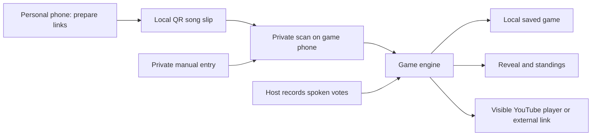

# Architecture

Status: Accepted design; platform behavior still requires Phase 1 device validation.

## Application shape

A static React + TypeScript + Vite PWA runs entirely in the browser. Use Tailwind CSS, `vite-plugin-pwa`, Vitest for engine tests, and Playwright for browser flows. This project does not need server rendering, a full-stack framework, a remote-query cache or a backend.

Use client views for Home, Prepare Songs, Setup/Private Handoff, Current Round and Results. Keep active/private gameplay state out of URLs. Separate the personal preparation draft from the current game.

This is data transfer between co-located devices, not a networked room. Theme and song count are shared verbally. A QR payload is plain structured data, not a remote resource or executable instruction.

## Boundaries and state

- **Game engine:** pure TypeScript transitions and scoring, independent of React, DOM, storage and playback. Inject shuffle randomness for tests; generate and retain order once on start.
- **UI:** renders a public projection that omits owner IDs, future songs and private setup details. Explicit private handoff reveals only the selected player's setup. Engine state must not be rendered into hidden DOM or debug panels.
- **Persistence adapter:** versioned JSON in `localStorage`, one current game. Save each transition, including before leaving for external playback. Surface failures, retain the in-memory session, and make clear that recovery is not guaranteed while saving is failing.
- **Song-slip adapter:** `qrcode` generates and `qr-scanner` reads compact payloads. Load camera/scanner functionality only for private import. Stop the camera when leaving the screen. No backend or YouTube Data API is needed.
- **Playback adapter:** receives only the current video ID; wraps the official iframe API and external link. Media callbacks report status but never award points or advance rounds.

Game transitions: `setup → playing → completed`. Within play: `listening → voting → revealed`, or an unresolved round becomes `skipped`. Discussion happens during listening, with no timer. The host explicitly begins voting, reveals, and advances. Vote changes are permitted during voting only. Skips are allowed during listening/voting, never after reveal.

Persist the shuffled order and round results; derive standings from results. Validate actions against the current phase. A repeated reveal returns the existing result rather than computing another award. Resume always uses saved state, not component mount effects.

The data contracts describe the minimum types and invariants. Do not add event sourcing, multiple state stores, distributed coordination, or a migration framework for v1.

## Private setup and QR transfer

The personal preparation view accepts 1–5 individual video links and generates a song slip locally. Keep the draft in memory; provide an explicit clear action. No player identity or theme is required in the slip; the importer associates it with a roster member.

On the game phone, the player intentionally enters private setup, scans, reviews, and confirms. Import atomically after all validation. Manual entry follows the same validation path. After completing or leaving private setup, replace private content with a handoff cover; browser back navigation must not restore it automatically. On reload, any saved private setup must also be covered.

The QR is not encrypted. Anyone who watches preparation or scans the slip could learn songs. The host must not supervise individual imports. Browser storage and developer tools can expose all answers; this accepted trust boundary is documented in ADR 0001.

## YouTube and mobile constraints

Accept standard individual YouTube and YouTube Music URLs containing video IDs, including short share URLs. Normalize to a video ID and build playback URLs from that validated value. Reject playlist-only links; omit tracking, playlist and timestamp parameters. Start videos normally, without imported offsets.

Use a visible official player with explicit host play interaction and a viewport of at least 200 × 200 pixels. Do not hide the video, separate its audio, suppress ads, proxy streams, or cache media. The iframe API reports embedding restrictions and unavailable videos; offer “Open in YouTube”, retry and skip rather than promising universal playback.

Switching apps can suspend or discard the PWA. External background playback may require a YouTube subscription and varies by region. Persist before opening the external link, restore when returning, and require host-controlled progress; do not depend on background timers or uninterrupted audio.

These are documented constraints, not completed device-test results:

- [YouTube iframe API: player requirements, autoplay and errors](https://developers.google.com/youtube/iframe_api_reference)
- [YouTube developer policy guide](https://developers.google.com/youtube/terms/developer-policies-guide)
- [YouTube Music sharing](https://support.google.com/youtubemusic/answer/9198182?hl=en)
- [YouTube Music background playback](https://support.google.com/youtubemusic/answer/6313552?hl=en)
- [Mobile page lifecycle](https://developer.chrome.com/docs/web-platform/page-lifecycle-api)

## Persistence, PWA and hosting

Use separate current-game and application-shell concerns. Service-worker caching is for first-party static assets only, not YouTube requests, QR submissions or personal data exports. After an initial successful load, the shell and local controls should work offline; media still needs internet.

Defer service-worker updates while a game is active. Resume a valid saved game; for corrupted/unsupported saves, show a recovery error and require explicit reset instead of erasing data silently. Replacing a game must be confirmed. Only one tab should operate a game; detect another tab's save changes and require reload rather than silently overwriting its state.

Cloudflare Pages serves the build output without Functions, Workers or external storage. Intended domain: `kaargaan.sohab.dev`. Domain configuration and publication are later authorized deployment work. No analytics or telemetry is required for personal use.

- [React with Vite and TypeScript](https://react.dev/learn/build-a-react-app-from-scratch)
- [Vite PWA guide](https://vite-pwa-org.netlify.app/guide/)
- [QR scanner](https://github.com/nimiq/qr-scanner) and [QR generator](https://github.com/soldair/node-qrcode)
- [Cloudflare Pages static asset pricing](https://developers.cloudflare.com/pages/functions/pricing/)
